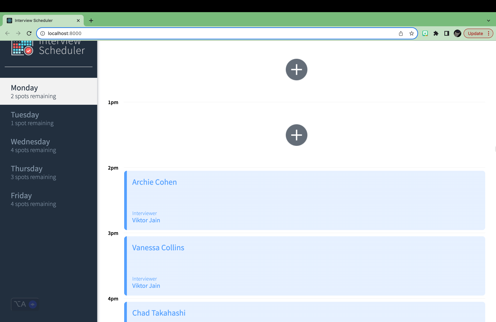
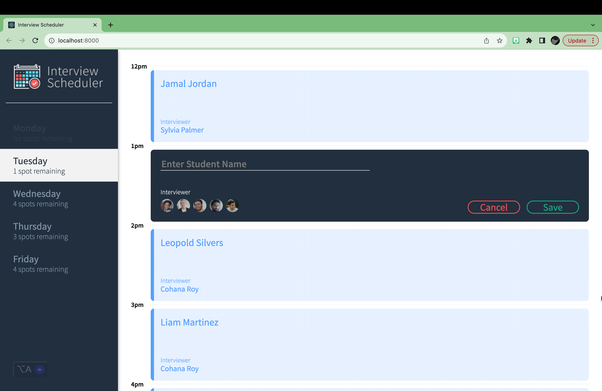
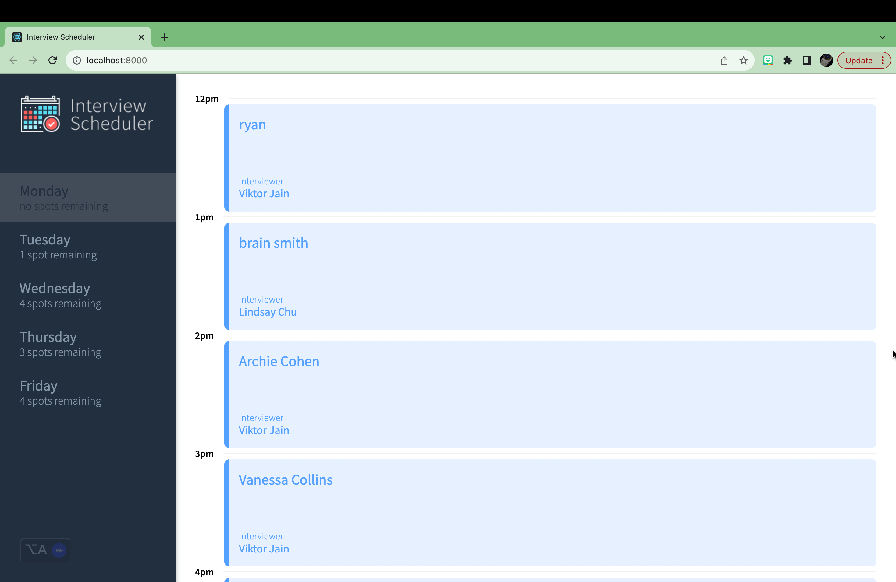
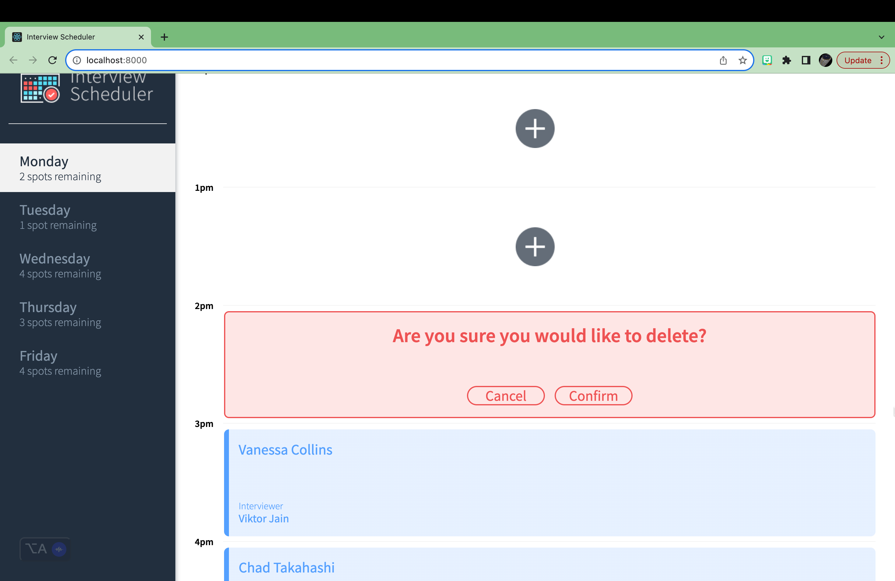

# Interview Scheduler

Interview Scheduler is a Single Page React Application. The App allows users to add, edit and delete appointments in real time. It uses React built-in and custom hooks Data and is persisted by the API server using a PostgreSQL database. The client application communicates with an API server over HTTP, using JSON format.

## Setup

Install dependencies with `npm install`.

## Running Webpack Development Server

```sh
npm start
```

## Running Jest Test Framework

```sh
npm test
```

## Daily view


## Book an Appointment


## No slot available


## Deleting an appointment



## API Server & Database setup

Must run both this file (the client) and the API server.

- Fork and clone the api server from here: https://github.com/lighthouse-labs/scheduler-api

- Follow the steps outlined in the README file to install and setup the database

- Fork and clone this repo down and install the dependencies with `npm install`

- after the database and the api server side is up and running, run this file with the conmmand `npm start`


